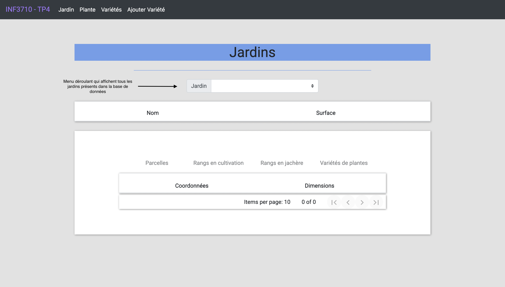
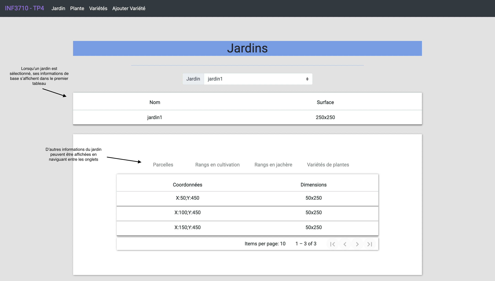
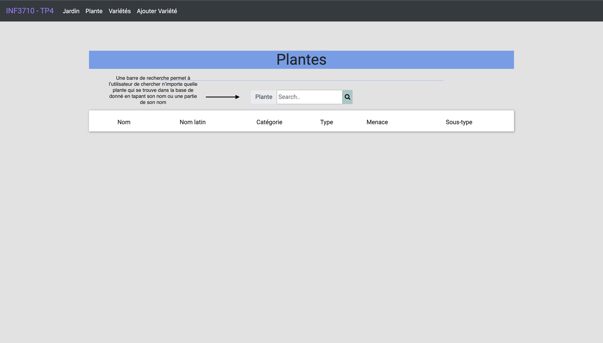
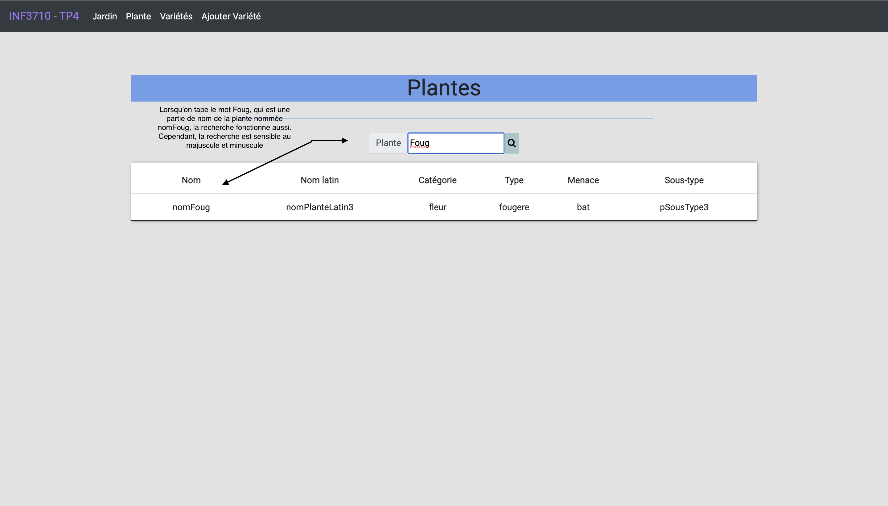
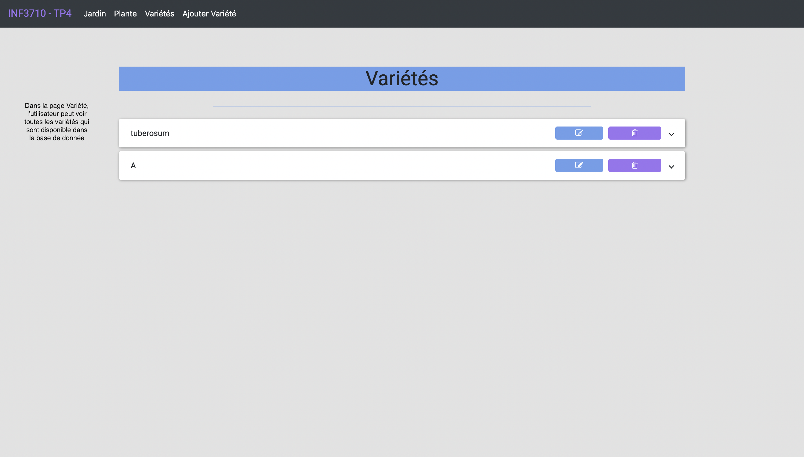
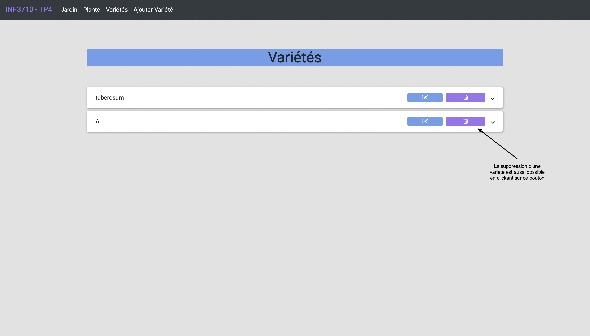
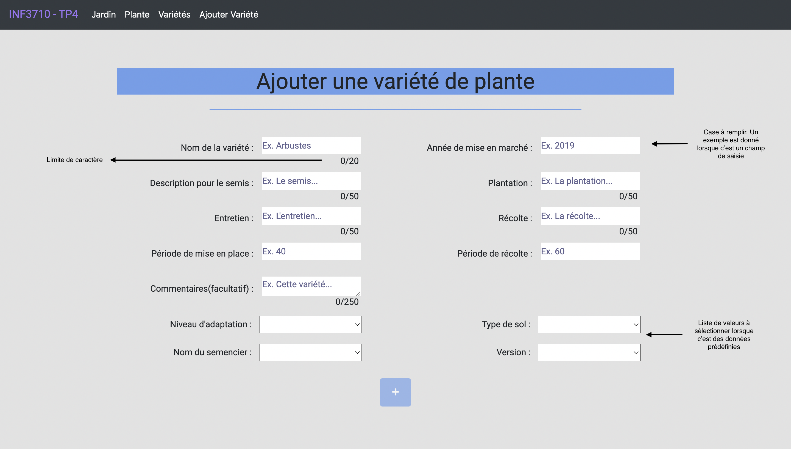
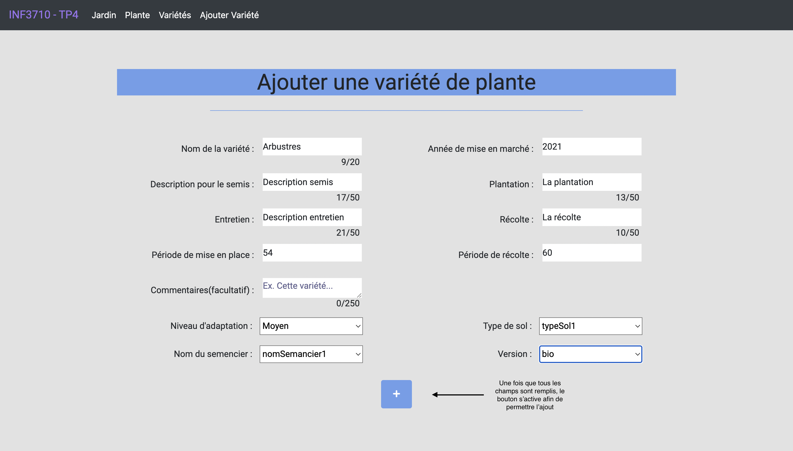
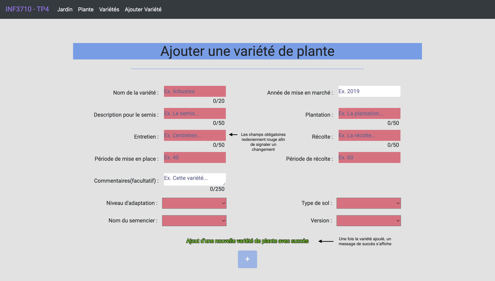

# Application web
## Guide de démarrage du projet

- Avoir installé la version 16 de NodeJS

- Assurez-vous que Postgres roule sur vos machines 

- Allez dans Postgres et créer une base de donnée nommée `garden` et faire rouler les scripts sql

- Allez dans `/client`  et lancez `npm install`

- Allez dans `/server` et lancez `npm install​`

## Pour lancer le projet

- Allez dans `/server` et faites `npm start`​

- Allez dans `/client` et faites `npm start`​

## Captures d'écran
### Page des jardin

### Page des plantes

### Page des variétés

### Page de l'ajout d'une variété

