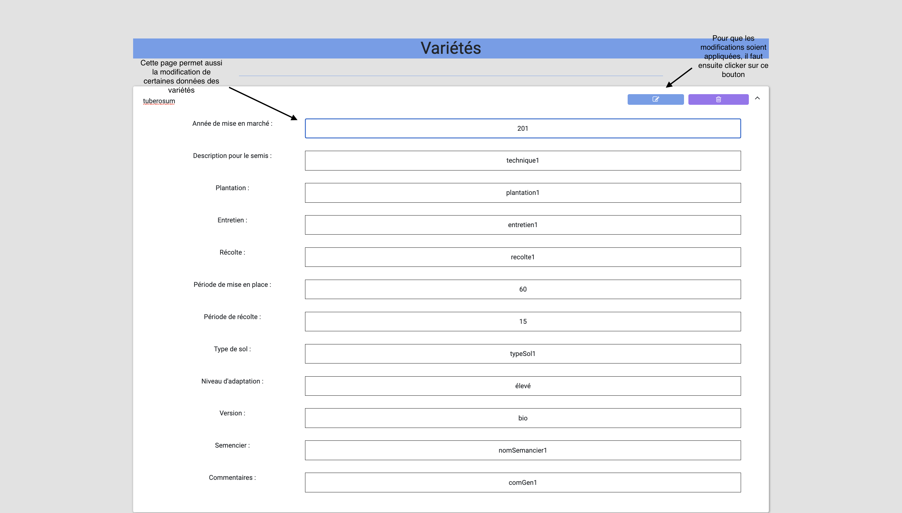
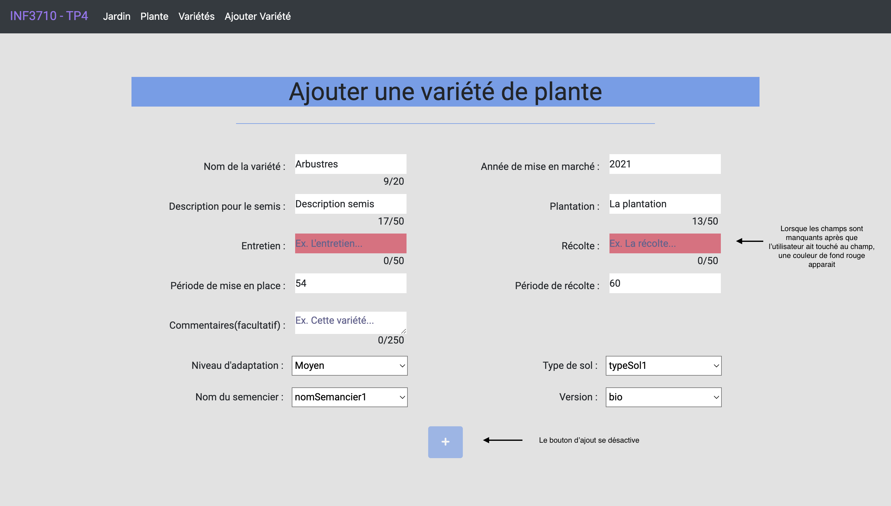

# Garden App
## Description

This is a simple and fun project that I've created to learn PostgresSQL. The project is about making queries to the DB from an web app to get and manipulate infos about plants 🪴! The client side was implemented using Angular framework, the backend was implemented with Typescript and the DB is PostgreSQL. 

⚠️ I did not provide the DB, therefore no data will be shown.

## Project Startup Guide

- Have installed version 16 of NodeJS

- Go to `/client` and run `npm install`

- Go to `/server` and run `npm install`

## Pour lancer le projet

- Go to `/server` and run `npm start`​

- Go to `/client` and run `npm start`​

<!-- ## Captures d'écran
### Page des jardins

---
### Page des plantes

---
### Page des variétés

---
### Page de l'ajout d'une variété

 -->
